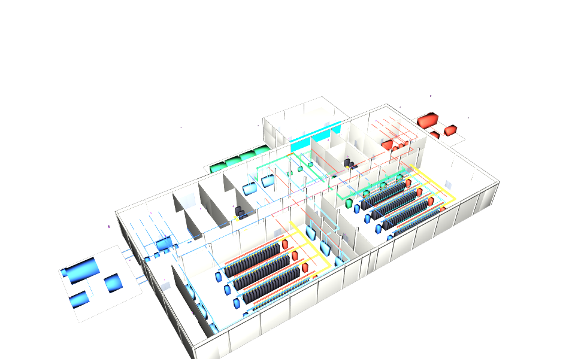

# usdaeco-revit — Revit host for driver-based USD exchange

## Use case

Edit a built element’s drivers in USD and let Revit solve the native model.
Sync publishes the resolved values, bodies and diagnostics in separate layers.
Read [the use case](docs/usecase.md) and [host capabilities](docs/host.md).

## The schema on an index card

| Contract | Ownership |
|---|---|
| Identity, ports, spatial referents | usdAeco core; no new schema in this integration |
| Intent, result, derived and diagnostic layers | usdAecoSync |
| `revit` entry point | `usdaeco_revit.host:RevitHost` |
| Geometry | Host output only; editors author drivers |

## The example

The offline example replays two recorded driver edits on real identities in the full
base facility, alongside a separate audit of archived live summary evidence.

```sh
env -u PYTHONPATH "$AECO_PYTHON" examples/roundtrip/run.py
```

Inputs, expected findings and provenance live in [examples/roundtrip](examples/roundtrip/README.md).
Open the committed [result/example.usdc](examples/roundtrip/result/example.usdc)
with stock `usdview`; it contains the final converged 12,276-prim facility and needs
no family plugins or sibling checkouts. The [result layers](examples/roundtrip/result/layers/)
preserve intent, result, diagnostics and derived opinions for inspection.
The cyan wall grows from 3.0 m to 3.4 m; the orange pipe widens from 0.20 m to
0.25 m. A presentation layer hides roofs for a cutaway view. The base has no
office pipe, so the nearest chilled-water pipe at the wing boundary is used.
`--publish` refreshes `result/`, the image and manifest after findings match;
ordinary runs write comparison evidence under `examples/roundtrip/out/`.



## Build and check

Use Python with usd-core, IfcOpenShell 0.8.5, NumPy, pytest and the toolchain render dependencies.
No package installation is required for source tests. Set `AECO_PYTHON` to that interpreter,
and set these checkout variables to the versions in dependencies.json:

```sh
export AECO_CORE="../usdaeco-core"
export AECO_CORE_ROOT="$AECO_CORE"
export CORE_PLUGIN_DIR="$AECO_CORE/usdAeco"
export AECO_AXIS_ROOT="../usdaeco-axis"
export AXIS_PLUGIN_DIR="$AECO_AXIS_ROOT/usdAecoAxis"
export PXR_PLUGINPATH_NAME="$CORE_PLUGIN_DIR:$AXIS_PLUGIN_DIR"
export AECO_SYNC_ROOT="../usdaeco-sync"
export AECO_IFC_ROOT="../usdaeco-ifc"
export TOOLCHAIN_DIR="../usdaeco-toolchain"
export AECO_DATACENTRE_ROOT="../usdaeco-datacentre"
export AECO_SCENARIOS_ROOT="../usdaeco-scenarios"
export AECO_CCTV_ROOT="../usdaeco-cctv"
export AECO_BUILDUP_ROOT="../usdaeco-buildup"
export AECO_WALL_ROOT="../usdaeco-wall"
export AECO_PIPE_ROOT="../usdaeco-pipe"
env -u PYTHONPATH PYTHONPATH="$AECO_CORE_ROOT:$PWD" "$AECO_PYTHON" check.py
env -u PYTHONPATH "$AECO_PYTHON" -m pytest -q
nix flake check
```

`AECO_CORE` selects core v0.9.2; `AECO_AXIS_ROOT` selects axis v0.1.2.
Core must precede axis on the plugin path. The three
kind libraries use their released v0.2.1 plugins. A resident Revit document and its REPL supply native execution.
Set `USDRECORD` to an OpenUSD usdrecord executable with Embree support; the macOS
system command may implement a different CLI.
The check ends with the family `N checks, M failed` line and includes structure lint,
fresh-result comparison (S27), portable source aliases (S29), an isolated stock USD render (S28), and all core
validators through UsdValidation. Missing core validators fail loudly.
Source bootstrap inserts tools into sys.path and materializes entry-point metadata
under ignored out/; it does not install a package or change a dependency checkout.

Flake inputs use public release names. For local source mapping use
`nix flake check --override-input core "path:$AECO_CORE" --override-input axis "path:$AECO_AXIS_ROOT" --override-input sync "path:$AECO_SYNC_ROOT" --override-input ifc "path:$AECO_IFC_ROOT" --override-input toolchain "path:$TOOLCHAIN_DIR"`
and override other inputs similarly. See the toolchain’s
[local input policy](https://github.com/criad-com/usdaeco-toolchain/blob/v0.3.8/docs/repo-conventions.md).
Native host availability is separate from Nix evaluation. Both the flake and
source commands use the committed flat plugin directories; no dependency build
is needed for the offline example.

The integration retains sync v0.5.2 (its own core/axis loader), CCTV v0.5.2,
IFC v0.2.0 and scenarios v0.6.0. This patch updates only data centre to v0.4.6
and toolchain to v0.3.8.
Select the pinned toolchain checkout with `TOOLCHAIN_DIR`; exact source revisions
are recorded in dependencies.json. Historical fixtures retain their original
versions under its separate `fixtures` section.

## Family

Core `>=0.9,<1.0`, axis `>=0.1,<0.2`, sync `>=0.5,<0.6`; IFC integration supplies the shared IFC
reader for export convergence.
Exact tested refs are in [dependencies.json](dependencies.json).
See the [family board](https://github.com/criad-com/usdaeco-board) and the
[sync host contract](https://github.com/criad-com/usdaeco-sync/blob/v0.5.2/docs/host-contract.md).

## Layout

`tools/usdaeco_revit/` owns the host, runtime and native protocol;
`testenv/` owns regression cases; `docs/` describes capabilities;
`examples/roundtrip/` owns the example. This is a schema-free integration,
generated from the family skeleton and checked against its applicable S-rules.

## Status

Version 0.1.4. See [prior release acceptance](docs/acceptance.md) for archived checks and deviations.
The source-based acceptance and deviations are in [facility replay verification](docs/facility-replay-verification.md).
Live execution remains NOT RUN. The offline recording was regenerated from the pinned
USD source; native solving, exporter port mapping and export/re-import are NOT PROVEN.

## Licence

[MIT](LICENSE). Copyright (c) 2026 Criad.

Third-party code is not vendored. Runtime and example dependencies retain their licences:

| Dependency | Licence and use |
|---|---|
| OpenUSD | Apache-2.0-style TOST; USD runtime and rendering |
| NumPy | BSD-3-Clause; numeric comparisons |
| IfcOpenShell | LGPL-3.0; imported only for export convergence |
| OCCT | LGPL-2.1; dynamically linked only, through IfcOpenShell |
| Pillow | HPND; render verification |
| embreex | Apache-2.0; optional camera coverage |
